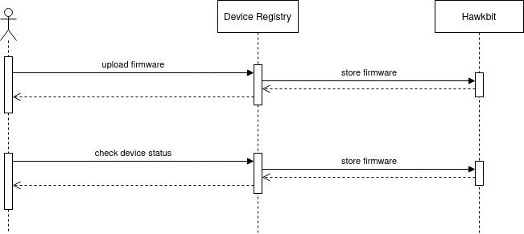
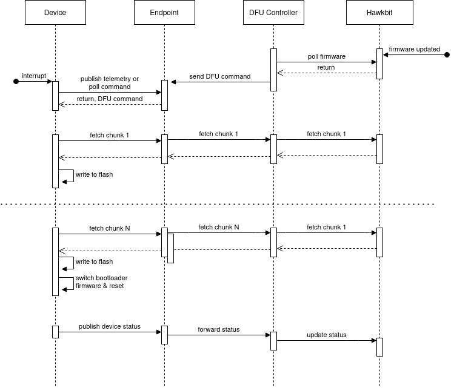

# *DRAFT* Firmware updates

## Glossary

* DFU: Device Firmware Update
* OTA: Over The Air

## Motivation

A common part in any IoT service is the ability to update a fleet of devices with the latest and greatest software. With Drogue IoT, there is an opportunity
to integrate the device side with the cloud side to improve the user experience.

High level goals:

* OTA DFU capability on all platforms supported by drogue-device
* Publish device firmware to drogue-cloud
* Roll out firmware to devices registered in drogue-cloud

As OTA DFU is a critical piece of msot IoT infrastructures, the capabilities will be embedded into the drogue iot ecosystem.

## Requirements

The requirements are subject to change, and reflect the minimal capabilities needed for an initial version of the OTA DFU to be feature complete.

The API in drogue-cloud should allow:

* (User facing) Publish a new firmware version
* (User facing) Update firmware for a group of devices
* (Device facing) Poll/Notify device about a new firmware version
* (Device facing) Fetch the new firmware

Drogue-device needs a bootloader that can:

* Boot firmwares (duh)
* Write new firmware versions to flash while current firmware is running (banking)
* Handle the case where the new firmware is not working (retry, roll back and load previous firmware)

To make DFU easy for firmware writes, drogue-device needs a component that can:

* Be notified of new firmware versions
* Use a network API (such as `TcpStack`) to fetch new firmware in chunks
* Use the bootloader API to write firmware chunks to flash

## Overall architecture

The overall architecture relies on capabilities currently exposed by [Eclipse Hawkbit](https://www.eclipse.org/hawkbit/). However, the APIs of Hawkbit are not exposed to the end user, nor the device. This is to ensure that the implementation can be changed at a later stage. It is assumed that firmware, versioning and device firmware state is stored in Hawkbit.

### Publishing a new firmware version

To publish a new version of the firmware, the device registry API is extended with the ability to upload firmware and specify the desired firmware and version of firmware for a given device, and inspect the actual state of the device using the device management API. The device registry calls into Hawkbit to store the desired state, and inspect the actual state of the device.

### Updating the firmware of a device

To update the firmware of a device, it must be notified of the new firmware. Once notified, the device takes responsibility of updating itself by fetching the firmware from the cloud. The HTTP endpoint provides an extended API to fetch firmware and update device status (version, progress and success/failure with diagnostics). The cloud side maintains the desired state as well as the actual state of a device and its firmware status in Hawkbit. The actual state represents the state _as seen from the device_ and is updated whenever the device publishes data to the HTTP endpoint DFU API. This ensures that the device side and cloud side does not have conflicting views about the state of the device.

A new component in drogue cloud, `DFU Controller`, is responsible for polling Hawkbit to check if there is a new firmware available for devices, and initiating the firmware update. When a new firmware is availble, the `DFU Controller` will send a command to the device asking it to update its firmware. The existing command API is used to notify devices of new firmware versions, using a predefined payload that is understood by drogue-device.

When the device has received the command to update its firmware, it will start the process of fetching the firmware and writing it to flash. Updating the firmware of the device must happen in chunks, as the firmware size is usually larger than the amount of RAM on the device. This chunking process is handled by passing the firmware size in the DFU command.

Once the firmware update is complete, the device will update the bootloader to use the new firmware and reset itself. During the update, and after reset, the device may send feedback to the HTTP endpoint of its progress and status.

The following diagram describes the process:

## Drogue Cloud

* TODO: Integration with Hawkbit
* TODO: DFU fetch API
* TODO: DFU status API
* TODO: DFU command spec

## Drogue Device

### Bootloader

* To simplify the design, the bootloader cannot be updated without re-flashing the device. 
* The bootloader will keep a 'current' firmware that it will boot first.
* If the device panics, it will retry the 'current' firmware until a max number of retries.
* If it panics and reaches max number of retries, diagnostics will be stored, and the 'previous' firmware will be used.

An alternative approach would be to bundle the bootloader with the minimal code to do networking: actor framework and a selected network driver + DFU actor that would consume less flash space than the full application.

* TODO: Bootloader 
* TODO: DFU Actor
