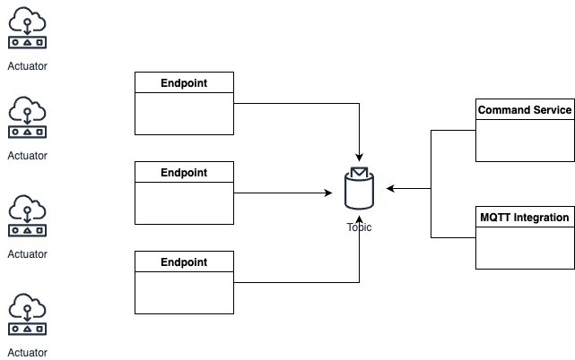
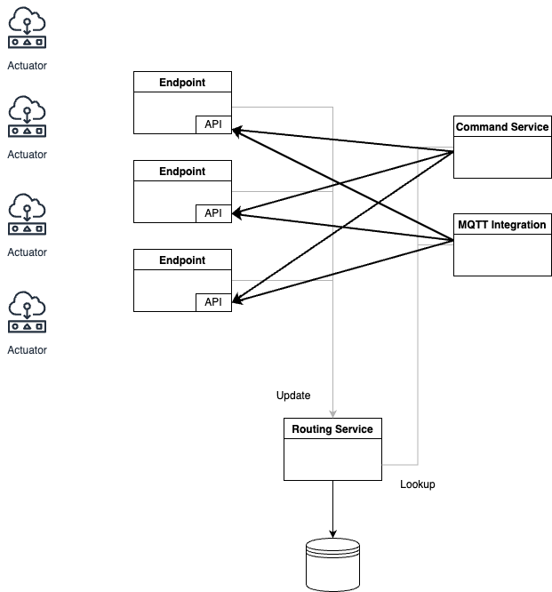

# [Cloud] Refactoring Commands

## Motivation

Improve how commands are delivered internally within cloud components.

## Current implementation

* Applications send commands to "command endpoint" or one of the integration APIs, like MQTT or Web Socket.
* All commands are then sent to the single Kafka topic.
* All device endpoints receive all commands and filter ones they can send to the devices connected to them.

### PROs

* Simple implementation

### CONs

* Every endpoint receive too many unnecessary commands.
* It can become a scalability problem as each endpoint need to process all commands. Each device endpoint is a potential bottleneck.
* Commands can be delayed because of the slow processing
* Device endpoint can't filter type of commands and can further dispatch unnecessary commands to the device.

## Suggested implementation

* Introduce new "Command routing service" that maintains a routing table of command subscriptions. Keeping track which device subscribes to which commands at which endpoint.
* Endpoints updates routing table on each device subscribe/unsubscribe by calling routing service API.
* On each command, command service or integration API does a lookup with the routing service and "push" command only to appropriate endpoint(s).

### PROs

* Endpoints receive only messages for devices that are connected to them and subscribed to the particular command
* Commands scalability is detached from the endpoints and can be supported by scaling up command/routing service

### CONs

* More complicated to implement. Besides the new routing service, endpoints need to implement state update and ping protocols.

## Implementation

* Implement "Command Routing" service similar to the "Device State" service, just instead of tracking connections, track command subscriptions along with the endpoint command URL. K8s Downward API can help (https://kubernetes.io/docs/tasks/inject-data-application/environment-variable-expose-pod-information/), with exposing endpoint pods for this purpose.
* Design and implement Routing query API, which will give appropriate endpoint URL for a given device and command.
* Implement logic for command service and integration APIs to do a lookup and send commands to the endpoint URLs.
* Internal routing within endpoint to devices will stay unchanged.